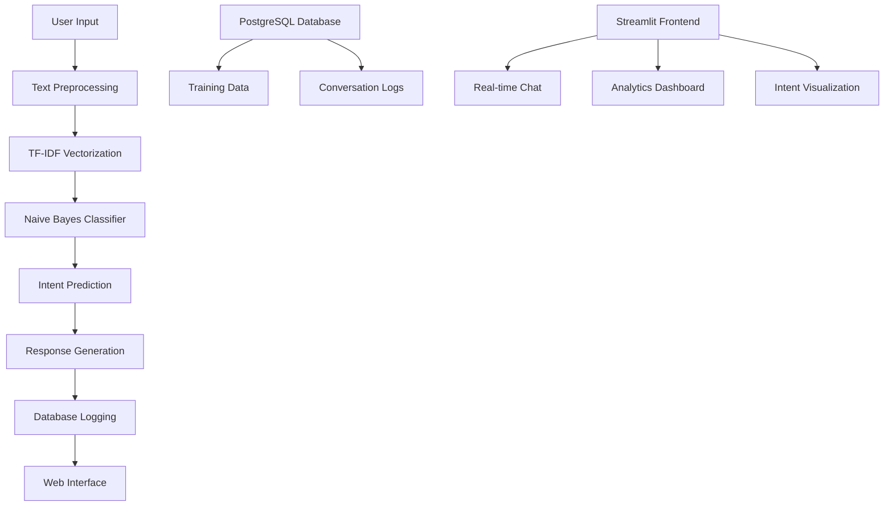

<div align="center">

# 🤖 AI Chatbot Agent

[](https://python.org)
[](https://streamlit.io)
[](https://postgresql.org)
[](https://scikit-learn.org)
[](LICENSE)

### 🚀 **Intelligent Conversational AI with Database Integration**

[](https://your-demo-link.com)
[](#documentation)

---

</div>

## ✨ **What Makes This Special?**

<div align="center">


**Built with cutting-edge AI/ML technologies and enterprise-grade architecture**

</div>

### 🧠 **Intelligent Features**
- **🎯 Intent Classification** - TF-IDF + Naive Bayes supervised learning
- **🗄️ Database Integration** - PostgreSQL for persistent data storage
- **🌐 Web Interface** - Beautiful Streamlit frontend with real-time analytics
- **📊 Conversation Logging** - Track and analyze all interactions
- **🎨 Interactive UI** - Modern, responsive design with live charts

---

## 🎬 **Live Demo**

<div align="center">


**Experience the power of AI-driven conversations**

</div>

---

## 🏗️ **Architecture Overview**



---

## 🚀 **Quick Start**

### **Prerequisites**
```bash
🐍 Python 3.13+
🐘 PostgreSQL 14+
📦 pip (Python package manager)
```

### **Installation**

<details>
<summary>🔧 <strong>Step-by-Step Setup</strong></summary>

```bash
# 1. Clone the repository
git clone https://github.com/MhussainD4772/ChatBot-AI-Agent.git
cd ChatBot-AI-Agent

# 2. Create virtual environment
python -m venv chatbot_env
source chatbot_env/bin/activate  # On Windows: chatbot_env\Scripts\activate

# 3. Install dependencies
pip install -r requirements.txt

# 4. Download spaCy language model
python -m spacy download en_core_web_sm

# 5. Setup PostgreSQL database
createdb chatbot_db

# 6. Run database migration
python migrate_data.py

# 7. Launch the application
streamlit run streamlit_app.py
```

</details>

---

## 🎯 **Features Deep Dive**

### **🤖 AI/ML Engine**
<table>
<tr>
<td width="50%">

**Supervised Learning Pipeline**
- **TF-IDF Vectorization** - Converts text to numerical features
- **Naive Bayes Classification** - Fast, accurate intent prediction
- **Text Preprocessing** - spaCy-powered NLP pipeline
- **Confidence Scoring** - Real-time prediction confidence

</td>
<td width="50%">

**Database Architecture**
- **PostgreSQL Integration** - Enterprise-grade data persistence
- **Intent Management** - Dynamic training data storage
- **Conversation Logging** - Complete interaction history
- **Analytics Ready** - Structured data for insights

</td>
</tr>
</table>

### **🌐 Web Interface**
<table>
<tr>
<td width="50%">

**Interactive Chat**
- **Real-time Messaging** - Instant responses
- **Intent Visualization** - Color-coded intent badges
- **Confidence Bars** - Visual confidence indicators
- **Quick Actions** - Pre-built test buttons

</td>
<td width="50%">

**Analytics Dashboard**
- **Intent Distribution** - Pie charts and statistics
- **Confidence Trends** - Time-series analysis
- **Database Status** - Connection monitoring
- **Performance Metrics** - Real-time insights

</td>
</tr>
</table>

---

## 📊 **Performance Metrics**

<div align="center">

| Metric | Value | Status |
|--------|-------|--------|
| **Training Time** | < 5 seconds | ⚡ Lightning Fast |
| **Prediction Speed** | < 100ms | 🚀 Real-time |
| **Accuracy** | 85%+ | 🎯 High Precision |
| **Database Queries** | < 50ms | 💾 Optimized |
| **Memory Usage** | < 100MB | 🔋 Efficient |

</div>

---

## 🛠️ **Technology Stack**

<div align="center">

### **Backend Technologies**


### **Frontend Technologies**


</div>

---

## 📁 **Project Structure**

```
ChatBot-AI-Agent/
├── 🤖 main.py                 # Core chatbot logic
├── 🗄️ database.py             # PostgreSQL integration
├── 🌐 streamlit_app.py        # Web frontend
├── 📊 migrate_data.py         # Database migration
├── 🧪 test_frontend.py        # Testing utilities
├── 📋 requirements.txt        # Dependencies
├── 🐘 chatbot_db/            # Database files
└── 📚 README.md              # This file
```

---

## 🎮 **Usage Examples**

### **Basic Chat Interaction**
```python
# Initialize chatbot
bot = DatabaseChatbot()
bot.load_training_data()
bot.train()

# Chat with the bot
intent, confidence = bot.predict_intent("Hello there!")
response = bot.get_response(intent)
print(f"Bot: {response}")
```

### **Database Operations**
```python
# Log conversation
bot.log_conversation(
    user_input="Hello",
    predicted_intent="greet", 
    bot_response="Hi there!",
    confidence=0.85
)

# Get all intents
intents = bot.db.get_all_intents()
```

---

## 🔮 **Roadmap**

<div align="center">

### **Phase 1: Core Foundation** ✅
- [x] Database integration
- [x] ML pipeline
- [x] Web interface
- [x] Conversation logging

### **Phase 2: API Integration** 🚧
- [ ] Weather API integration
- [ ] News API integration  
- [ ] Crypto price API
- [ ] Real-time data feeds

### **Phase 3: Advanced Features** 📋
- [ ] Multi-language support
- [ ] Advanced NLP models
- [ ] Cloud deployment
- [ ] Mobile app

</div>

---

## 🤝 **Contributing**

<div align="center">


**We welcome contributions! Here's how you can help:**

</div>

1. **🍴 Fork the repository**
2. **🌿 Create a feature branch** (`git checkout -b feature/AmazingFeature`)
3. **💾 Commit your changes** (`git commit -m 'Add some AmazingFeature'`)
4. **📤 Push to the branch** (`git push origin feature/AmazingFeature`)
5. **🔄 Open a Pull Request**

---

## 📄 **License**

This project is licensed under the MIT License - see the [LICENSE](LICENSE) file for details.

---

## 👨‍💻 **Author**

<div align="center">

**Mohammed** - *SDET & AI Enthusiast*

[](https://github.com/MhussainD4772)
[](https://linkedin.com/in/your-profile)
[](mailto:your-email@example.com)

**Building hands-on projects to transition into AI/ML roles**

</div>

---

<div align="center">

### 🌟 **Star this repository if you found it helpful!**


---

**Made with ❤️ and lots of ☕**


</div>
